 

<a href="https://imed.dev"><b>imed.dev</b></a>
&nbsp;·&nbsp;
<a href="https://www.linkedin.com/in/boumalek-imed">LinkedIn</a>
&nbsp;·&nbsp;
<a href="https://github.com/imedboumalek">GitHub</a>
&nbsp;·&nbsp;
<a href="mailto:info@imed.dev">info@imed.dev</a>

 

I build products end-to-end — then lead the teams that ship them and automate the
parts that don't need a human. Right now that means running **[Attraxia](https://imed.dev/projects/attraxia)**,
a software & recruitment agency I founded, and figuring out how far AI and
automation can compound one person's output.

Before founding, I spent years as a senior **Flutter / mobile engineer** turned
product owner — Clean Architecture, IoT, design systems, the occasional
open-source plugin.

### Selected work

**[Attraxia](https://imed.dev/projects/attraxia)** — Bootstrapped a software &
recruitment agency to €30k+/month, with core operations running on n8n and
webhooks instead of headcount.

**[Wergonic Platform](https://imed.dev/projects/wergonic-platform)** — Rebuilt a
single app into a full AI-powered platform suite (mobile + org + admin), leading
a cross-functional team of eight.

**[Pavlok App & OrchidUI](https://imed.dev/projects/pavlok-orchidui)** — A
cross-platform IoT app for a habit-change wearable, a Dart BLE plugin, and a
reusable design system.

→ The rest lives at **[imed.dev](https://imed.dev)**.